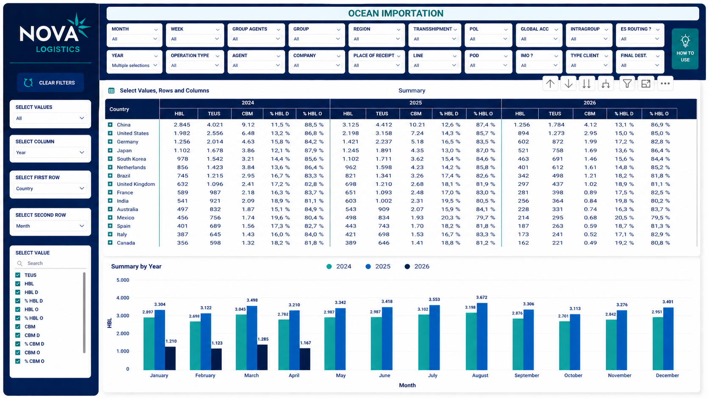
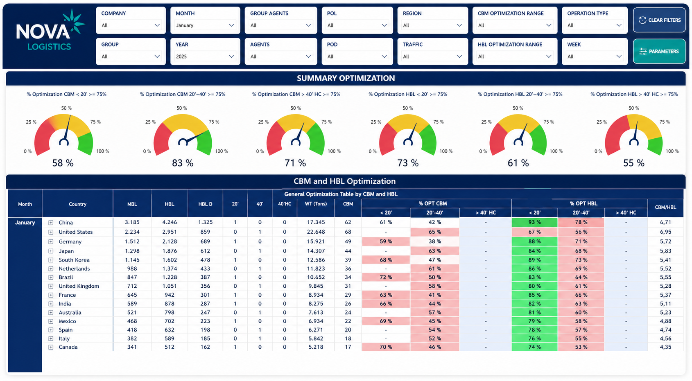
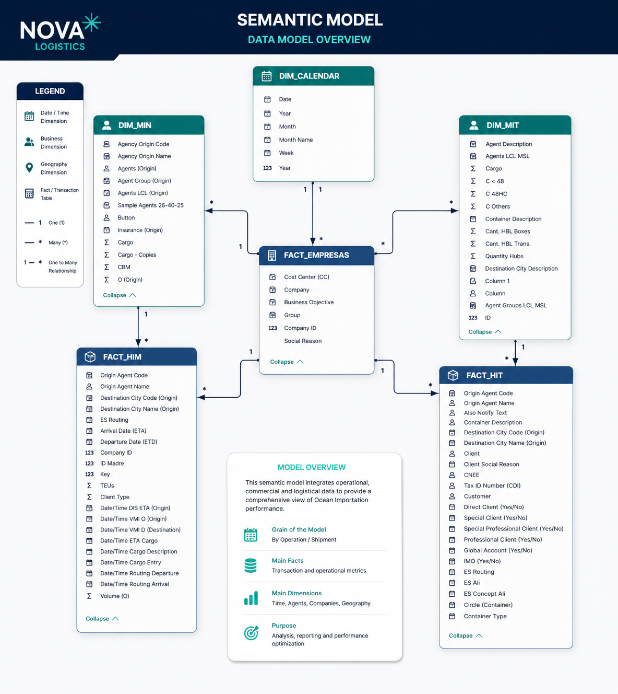

# Nova Logistics: Ocean Importation & Performance Optimization

## 📊 Visualización de Paneles
### Dashboard de Optimización (CBM & HBL)

### Resumen de Importación Oceánica (Comparativa YOY)

## 📌 Escenario de Negocio
El departamento de logística global de Nova Logistics requería una herramienta para medir los arribos de importación marítima (embarques) a partir de mediciones estandard en la industria: cantidad de carga (HBL), CBM (volumen), WT (Weight) y sus derivados operativos y comerciales. En paralelo se buscaba obsevar la eficiencia en el uso de contenedores. Un contenedor se optimiza tanto por CBM, es decir m2 de la carga y por otro lado por Carga . El objetivo es identificar desviaciones en la carga y optimizar la rentabilidad de cada envío mediante el monitoreo de KPIs de cumplimiento con un benchmark objetivo del 75%.

## 📌 El Problema 1 : Reacción vs. Previsión
En la logística, enterarse de que un contenedor viajó semi-vacío cuando ya llegó a destino es un error costoso. Tradicionalmente, los reportes se centran en la carga ya arribada, lo que deja a la empresa sin margen de maniobra.

**La solución:** Este sistema cambia el paradigma hacia la **previsión**. Analiza las cotizaciones realizadas y vigentes, permitiendo al equipo de ventas tomar accion.

## 📌 Problema 2: El Abismo Técnico en Organizaciones Grandes

En empresas de gran envergadura, el desafío no es solo procesar datos, sino asegurar que **personas con distintos niveles de conocimiento y capacidades** puedan interpretarlos. El software de BI a menudo falla porque es demasiado rígido para el usuario o no lo entiende o está acostumbrado a la flexibilidad total de las planillas de cálculo, aunque su armado individual insuma muchas horas. 

Esta brecha técnica genera fracturas: solo unos pocos "expertos" usan el dashboard, mientras el resto sigue operando con procesos manuales y descentralizados.

### **La Solución**: Democratización mediante Parámetros de Campo

Este sistema utiliza un recurso muy olvidado de Power BI: los **Parámetros de Campo** para construir una matriz de consulta dinámica que actúa como un puente cultural.

*   **Interfaz Familiar:** Al permitir que el usuario elija sus propias filas, columnas y métricas, el dashboard se comporta como una **Tabla Dinámica inteligente**. Esto nos permite aprovechar el conocimiento previo que todos los usuarios tienen sobre hojas de cálculo, eliminando la curva de aprendizaje.
*   **Eliminación de la Rigidez:** Ya no existe un "único reporte". El usuario tiene la autonomía para "armar su propia aventura" analítica, lo que garantiza una adopción masiva de la herramienta y una visión unificada de la verdad, independientemente de la capacidad técnica de quien la use.

### 🚀 Resultado: Acción Comercial Directa
Al simplificar el acceso a las cotizaciones vigentes y pasadas mediante esta matriz, el equipo de ventas deja de perder tiempo buscando archivos y empieza a **tomar acción**. La información deja de ser un gráfico estático y se convierte en una herramienta de negociación activa.

## 🏗️ Arquitectura del Modelo Semántico

El núcleo de este proyecto es un modelo de datos complejo que integra múltiples procesos de negocio mediante tablas de hechos vinculadas a dimensiones compartidas.

*   **Granularidad:** El modelo opera a nivel de Operación / Embarque (Operation / Shipment).
*   **Tablas de Hechos:** 
    *   `FACT_MIM`: Métricas operativas de importación.
    *   `FACT_MEM`: Detalles transaccionales y de ruteo.
*   **Dimensiones Centrales:** Calendario, Agentes (Origin/LCL), Geografía, Empresas y Compañías.

## 🛠️ Stack Tecnológico
*   **Power BI:** Modelado y visualización avanzada.
*   **Seguridad**: Implementación de Row-Level Security (RLS) dinámico por región de usuario.
*   **DAX:** Implementación de lógica para medidores (Gauges) de performance y parámetros dinámicos de selección.
*   **Orquestación**: Apache Airflow.
*   **SQL:** Procesamiento de la capa de datos.

## Desafíos Técnicos Resueltos

1. **Arquitectura de Datos Multi-Fact**: Diseño e implementación de un modelo semántico capaz de integrar tres procesos de negocio independientes (Comercial, Operativo y Transaccional). Se resolvió la ambigüedad en filtros cruzados mediante una gestión rigurosa de dimensiones compartidas, garantizando la integridad de los datos en esquemas de estrella complejos.

2. **Análisis Ad-hoc mediante Parámetros de Campo**: Implementación de una interfaz de usuario flexible que permite la reconfiguración dinámica de matrices de datos. Esta solución democratiza el acceso a la información, permitiendo que usuarios con diversos niveles de competencia técnica realicen consultas personalizadas sin necesidad de nuevas intervenciones de ingeniería.

3. **Monitoreo de Eficiencia Segmentado**: Desarrollo de indicadores visuales con lógica condicional para auditar el cumplimiento de optimización (CBM/HBL). El sistema desglosa la performance por tipo de unidad (20', 40', 40'HC), permitiendo detectar ineficiencias específicas por equipo y optimizar el aprovechamiento de activos.

## Impacto Estratégico

* **Inteligencia Histórica y Comparativa**: Establecimiento de un benchmark temporal sólido que abarca el periodo 2024-2026. La visibilidad de la evolución del volumen (CBM) permite identificar patrones estacionales y tendencias de mercado para la planificación estratégica a largo plazo.

* **Protección Proactiva de Márgenes**: Reducción de sobrecostos operativos mediante la detección temprana de rutas y agentes con una ocupación inferior al 75%. Esta capacidad de previsión permite ejecutar acciones correctivas en la fase de pre-embarque, impactando directamente en la rentabilidad del negocio.

* **Sincronización Operativa Global**: La arquitectura optimizada redujo la latencia en la consulta de datos distribuidos, transformando un proceso de reporte manual de tres días en un flujo de información automatizado y en tiempo real.

---
*Nota: Este repositorio documenta la arquitectura y desarrollo de un proyecto real implementado en producción. Para cumplir con las políticas de privacidad y acuerdos de confidencialidad (NDA), todos los datos financieros, volúmenes operativos y nombres de entidades han sido estrictamente alterados y anonimizados.*
